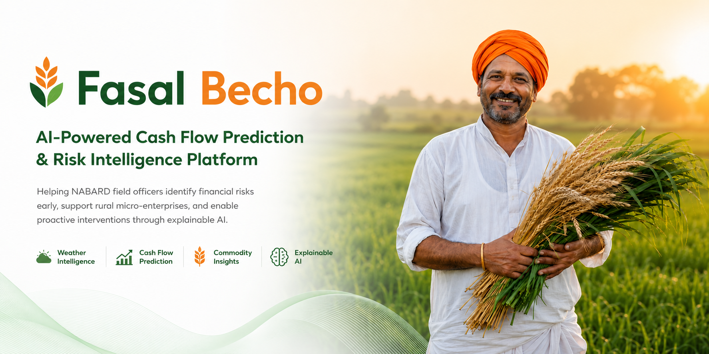
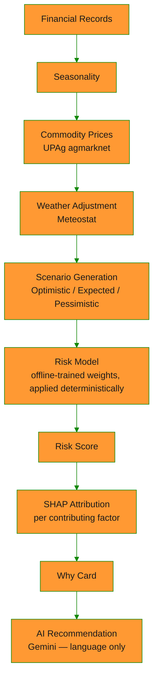
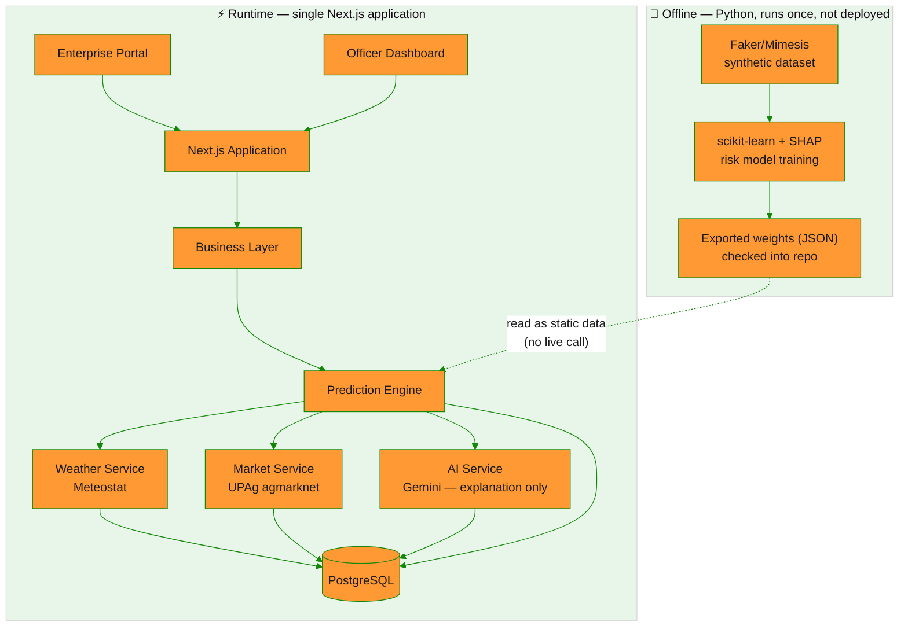
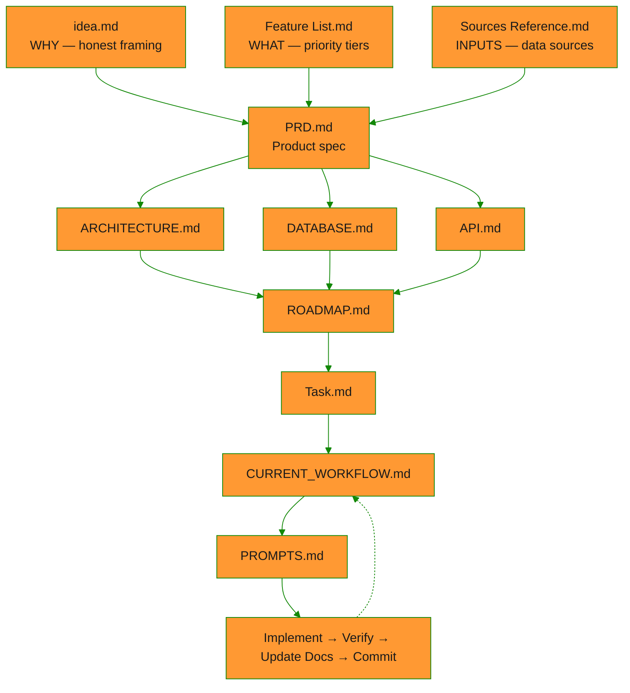

<div align="center">



<br/>

[](https://git.io/typing-svg)


<br/>

<a href="#-the-product-tour"></a>
<a href="#-why-fasal-becho"></a>
<a href="docs/idea.md"></a>

</div>


<br/>

## 🧭 The One-Liner

> **Fasal Becho turns a NABARD field officer's impossible job — watching hundreds of rural micro-enterprises for early signs of cash-flow stress — into a sorted, explainable priority list.**
>
> No dashboards to babysit. No black-box scores. Just: *"here's who needs you first, and here's exactly why."*

<br/>

<div align="center">

| 👤 1 Officer | 🏪 100s of Enterprises | 🔢 4 Live Signals | 📈 3 Scenarios | 💬 100% Explained |
|:---:|:---:|:---:|:---:|:---:|
| Can't visit everyone | Most get checked too late | Financial · Seasonal · Market · Weather | Optimistic / Expected / Pessimistic | Every flag has a plain-language reason |

</div>

<br/>

## ❗ The Problem

Field officers can build deep relationships with a handful of enterprises — everyone else gets checked on infrequently, so financial stress builds unnoticed until it becomes a crisis.

<table>
<tr>
<td width="20%" align="center">📋<br/><b>Manual monitoring</b></td>
<td>There's no early-warning signal — officers find out something's wrong when it already is.</td>
</tr>
<tr>
<td align="center">🗓️<br/><b>Seasonal swings</b></td>
<td>A slow month looks identical to real trouble, unless you know the crop/festival calendar.</td>
</tr>
<tr>
<td align="center">🌾<br/><b>Price volatility</b></td>
<td>Mandi price shifts move enterprise revenue long before anyone notices in person.</td>
</tr>
<tr>
<td align="center">🌦️<br/><b>Weather risk</b></td>
<td>A delayed monsoon quietly shifts cash flow timing weeks before the visible impact.</td>
</tr>
<tr>
<td align="center">👥<br/><b>Impossible caseload</b></td>
<td>One officer, hundreds of enterprises — attention is the scarcest resource in the system.</td>
</tr>
</table>

<br/>

## 💡 The Solution

A **deterministic, auditable 4-step pipeline** turns raw signals into a triage priority — then AI explains it in plain language, never the other way around.

```mermaid
%%{init: {'theme':'base', 'themeVariables': {'primaryColor':'#FF9933','primaryTextColor':'#1a1a1a','primaryBorderColor':'#138808','lineColor':'#138808','secondaryColor':'#ffffff','tertiaryColor':'#e8f5e9'}}}%%
flowchart LR
    A["📊 Financial Baseline<br/>UPI velocity"] --> B["🗓️ Seasonality<br/>crop / festival calendar"]
    B --> C["🌾 Market Reality<br/>UPAg agmarknet"]
    C --> D["🌦️ Weather Deflator<br/>Meteostat"]
    D --> E["📈 Triple Scenario<br/>Optimistic · Expected · Pessimistic"]
    E --> F["🚦 Risk Score<br/>+ Working Capital Dip"]
    F --> G["💬 Why Card<br/>SHAP → plain language"]
    G --> H["✅ Officer Decides"]
```



This produces:

- 📈 **Triple-line cash-flow chart** — Optimistic / Expected / Pessimistic, not one unfalsifiable number
- ⚠️ **Working Capital Dip alert** — flags the zero-crossing point, plainly stated
- 🚦 **Field-officer risk queue** — a sorted priority list, the first thing officers see
- 💬 **"Why" card** — one-line plain-language attribution per flag
- 🤖 **AI recommendation** — Gemini turns the numbers into next steps, never calculates them

<br/>

## ⭐ Why Fasal Becho

Most "AI fintech" pitches overclaim. We deliberately don't — and that honesty is the product's core credibility.

<table>
<tr>
<th align="left" width="50%">🚫 What we don't claim</th>
<th align="left" width="50%">✅ What we actually built</th>
</tr>
<tr>
<td valign="top">

An AI model that predicts real-world cash flow with proven accuracy — that claim doesn't hold up on synthetic data, and it shouldn't be trusted from anyone who makes it on synthetic data either.

</td>
<td valign="top">

A **rule-based scenario simulator with a genuine explainability layer** — transparent, auditable logic that turns four real signals into a triage priority + a human-readable reason.

</td>
</tr>
<tr>
<td valign="top">

A lending, underwriting, or credit-scoring product — and it never will become one, in any future version.

</td>
<td valign="top">

A **triage layer**: *"we don't originate or price credit — we're the layer that decides which enterprise gets a human's attention first."*

</td>
</tr>
<tr>
<td valign="top">

A live ML service that "thinks" in real time.

</td>
<td valign="top">

A **real, trained scikit-learn model with SHAP attributions** — trained once offline, exported as static weights, applied deterministically. Reproducible, inspectable, never a black box.

</td>
</tr>
</table>

> We're not competing with lending/underwriting products like Kaleidofin, Avanti, or KarmaLife — different category, different job. Full positioning: [`docs/idea.md`](docs/idea.md).


## 🎬 The Product Tour

The demo opens on the **Officer Dashboard** — not a landing page. The Risk Queue is the strongest first impression, and every step below answers one question the officer actually has.

<table>
<tr>
<td width="60px" align="center"><h3>1️⃣</h3></td>
<td><b>Officer Dashboard → Risk Queue</b><br/>A sorted priority list. Not a dashboard to babysit — a queue to work through.</td>
</tr>
<tr>
<td align="center"><h3>2️⃣</h3></td>
<td><b>Open a flagged enterprise</b><br/>One click from "who's at risk" to "why, exactly."</td>
</tr>
<tr>
<td align="center"><h3>3️⃣</h3></td>
<td><b>Triple-scenario cash-flow chart</b><br/>Optimistic / Expected / Pessimistic — a range, not a false-precision single number.</td>
</tr>
<tr>
<td align="center"><h3>4️⃣</h3></td>
<td><b>Working Capital Dip alert</b><br/>The exact point cash flow crosses zero, stated in plain language.</td>
</tr>
<tr>
<td align="center"><h3>5️⃣</h3></td>
<td><b>Why Card</b><br/>e.g. <i>"12% downward trend in Mandi prices for Paddy"</i> — every flag, explained, never just a score.</td>
</tr>
<tr>
<td align="center"><h3>6️⃣</h3></td>
<td><b>AI recommendation</b><br/>Gemini turns the numbers into a next action — language only, never the calculation.</td>
</tr>
<tr>
<td align="center"><h3>7️⃣</h3></td>
<td><b>Officer acts or overrides</b><br/>Every flag is advisory. The officer always makes the final call.</td>
</tr>
</table>

<br/>

## 🧩 Feature Highlights

| 🌾 Enterprise | 👮 Officer | 🧠 Intelligence |
|:---|:---|:---|
| Business Profile | **Risk Queue** *(first screen)* | Triple-Scenario Forecast |
| Financial Records | Dashboard | Working Capital Dip Detection |
| Income & Expenses | Enterprise Review | Explainable Why Card |
| Loans & Savings | Officer Actions & Override | AI-Generated Recommendations |
| Works Offline, Syncs Later | Search & Filters | SHAP-Backed Risk Model |

<br/>

## 🏛️ Product Positioning

<table>
<tr>
<th align="center" width="50%">🚫 Fasal Becho is <u>NOT</u></th>
<th align="center" width="50%">✅ Fasal Becho <u>IS</u></th>
</tr>
<tr>
<td valign="top">

- A lending platform
- A loan management system
- A credit approval engine
- A credit scoring product
- A banking application
- An AI model claiming proven predictive accuracy on real-world cash flow

</td>
<td valign="top">

- A decision-support platform
- A risk prioritization system
- A rule-based cash-flow scenario simulator with an explainability layer
- A human-in-the-loop intelligence layer

</td>
</tr>
</table>

Full detail: [`docs/PRD.md`](docs/PRD.md) (Section 4).


## 🏗️ Under the Hood

<details>
<summary><b>🔄 Prediction Pipeline (click to expand)</b></summary>
<br/>



The **Risk Model** node is not live inference — it's a static artifact trained once in Python and read like any other data file. Full detail: [`docs/ARCHITECTURE.md`](docs/ARCHITECTURE.md) Section 3a.

</details>

<details>
<summary><b>🏗️ System Architecture (click to expand)</b></summary>
<br/>



Full layer/module breakdown: [`docs/ARCHITECTURE.md`](docs/ARCHITECTURE.md).

</details>

<br/>

<div align="center">


</div>

| Layer | Technology |
|---|---|
| Frontend | Next.js + React + TypeScript |
| UI | Tailwind CSS + shadcn/ui |
| Backend | Next.js Route Handlers |
| ORM / Database | Prisma + PostgreSQL |
| **Data Science** *(offline only)* | Python, Faker / Mimesis, NumPy / Pandas, scikit-learn, SHAP |
| Generative AI *(runtime, language only)* | Gemini |
| Charts | Recharts |
| Offline *(client, PWA)* | PWA + IndexedDB |
| Deployment | Vercel |

> **Where's the AI/ML?** The risk model is real, trained machine learning — a small, transparent scikit-learn model explained with SHAP feature attributions, not a rebrand of a REST call. It's trained **offline in Python, once**, and its weights are exported as a static artifact checked into the repo. The deployed app *reads* those weights and applies them as plain, deterministic arithmetic — it never trains a model or calls a live Python process at request time. Gemini is a separate integration used only to turn the resulting numbers into plain-language sentences. Full detail: [`docs/ARCHITECTURE.md`](docs/ARCHITECTURE.md) Section 3a.

<br/>

## 🔎 Data & Trust

Transparency about data is part of the product, not a footnote.

| Source | Role | Status |
|---|---|:-:|
| 🌾 **UPAg `agmarknet`** | Live mandi commodity prices → Market Reality step | 🟢 Primary |
| 🌦️ **Meteostat** | Historical weather by station/lat-long → Weather Deflator step | 🟢 Primary |
| 🧬 **Faker/Mimesis** | Synthetic transaction generator, fixed seed, disclosed upfront | 🟢 Foundation |
| 🔬 **scikit-learn + SHAP** | The risk model — trained offline once, exported as static weights | 🟢 Core AI/ML |
| 💬 **Gemini** | Explanation and recommendation text only, never the calculation | 🟢 Explainability |
| 📊 NPCI aggregate stats | Macro calibration for the synthetic generator, never a live per-enterprise input | ⚪ Calibration |
| 🏦 Sahamati AA schema | Shape reference for mock records — AA integration itself is mocked, not live | ⚪ Reference |

All synthetic financial data is disclosed upfront, generated with a fixed seed so demo numbers are reproducible run-to-run. Full breakdown: [`docs/Sources Reference.md`](<docs/Sources Reference.md>).


## 🛣️ Roadmap

<div align="center">


*(live status: [`docs/CURRENT_WORKFLOW.md`](docs/CURRENT_WORKFLOW.md))*

</div>

**Now — MVP for the hackathon:** one sector, fully real, end-to-end — Risk Queue, Triple Chart, Working Capital Dip, Why Card, offline entry + sync.

**Later — post-hackathon only:**

- 🌍 Multi-sector support
- 📊 Portfolio analytics & district heatmaps
- 🔔 Notification engine
- 📱 Mobile application
- 🏦 Live Account Aggregator integration
- 🗣️ Multilingual / vernacular interface

11 phases, 33 tasks, 134 processes — the full build tracker lives in [`docs/Task.md`](docs/Task.md), sequencing rationale in [`docs/ROADMAP.md`](docs/ROADMAP.md).

<br/>

## 👩‍💻 For Developers

<details>
<summary><b>Click to expand — spec-driven workflow, docs map, local setup, project structure</b></summary>

### ▶️ Starting or resuming development

You only ever need to give one instruction:

```
Start with PROMPTS.md
```

[`docs/PROMPTS.md`](docs/PROMPTS.md) — specifically **Prompt 20, "Complete Feature Workflow"** — tells the assistant to read every spec document, check [`docs/CURRENT_WORKFLOW.md`](docs/CURRENT_WORKFLOW.md) and [`docs/Task.md`](docs/Task.md) for the active phase/task/process, plan the next unit of work, implement it, verify it, and update the tracking docs.

### 📐 Spec-Driven Development

Nothing gets built without a spec behind it. Every implementation decision traces back through a fixed chain of documents:



1. **Every phase is broken into tasks, and every task into processes.**
2. **The spec docs outrank the code.** `idea.md` / `Feature List.md` / `Sources Reference.md` outrank even `AGENTS.md` on product framing.
3. **One instruction resumes everything.** `docs/CURRENT_WORKFLOW.md` always reflects the live state.

### 📚 Documentation Map

| Document | Purpose |
|---|---|
| [`docs/idea.md`](docs/idea.md) | **Start here.** The honest framing — why this exists, what it is/isn't, open questions |
| [`docs/Feature List.md`](<docs/Feature List.md>) | Priority tiers: Core / Important / Cut / Pitch-only / Stretch |
| [`docs/Sources Reference.md`](<docs/Sources Reference.md>) | How every external data source is actually used |
| [`docs/PRD.md`](docs/PRD.md) | Product requirements — users, workflows, MVP scope |
| [`docs/ARCHITECTURE.md`](docs/ARCHITECTURE.md) | System architecture — layers, modules, data flow |
| [`docs/DATABASE.md`](docs/DATABASE.md) | Logical data model — entities, relationships, validation |
| [`docs/API.md`](docs/API.md) | API contract — endpoints, response shape, standards |
| [`docs/ROADMAP.md`](docs/ROADMAP.md) | Phase sequencing and dependency order |
| [`docs/Task.md`](docs/Task.md) | Phase → Task → Process checklist (the live build tracker) |
| [`docs/CURRENT_WORKFLOW.md`](docs/CURRENT_WORKFLOW.md) | Current state — updated every session |
| [`docs/PROMPTS.md`](docs/PROMPTS.md) | The prompt library that drives every session |
| [`docs/Agent.md`](docs/Agent.md) | AGENTS.md — engineering source of truth for AI coding assistants |
| [`docs/PROJECT_RULES.md`](docs/PROJECT_RULES.md) | Engineering rules and definition of done |

### 📁 Project Structure

```text
app/
components/
services/
business/
prisma/
public/
docs/
```

### 🚀 Local Setup

```bash
git clone https://github.com/Agnik47/Fasal-Becho.git

cd app

npm install

cp .env.example .env

npm run dev
```

**Data science pipeline** *(optional, offline only)* — only needed to regenerate the synthetic dataset or retrain the risk model:

```bash
pip install faker mimesis numpy pandas scikit-learn shap meteostat
```

</details>


<div align="center">

## 👥 Team

Built for the **NABARD Hackathon 2026** 🇮🇳

*Helping field officers know who needs their attention first.*

<br/>

**📄 MIT License**


<sub>Made with 🌾 for Rural Bharat</sub>

</div>
