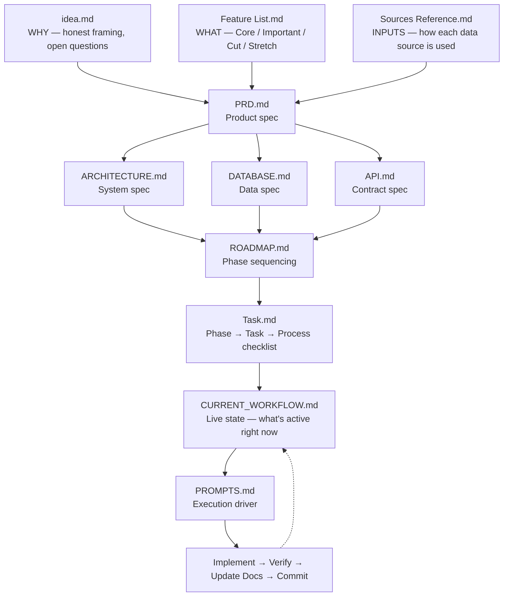
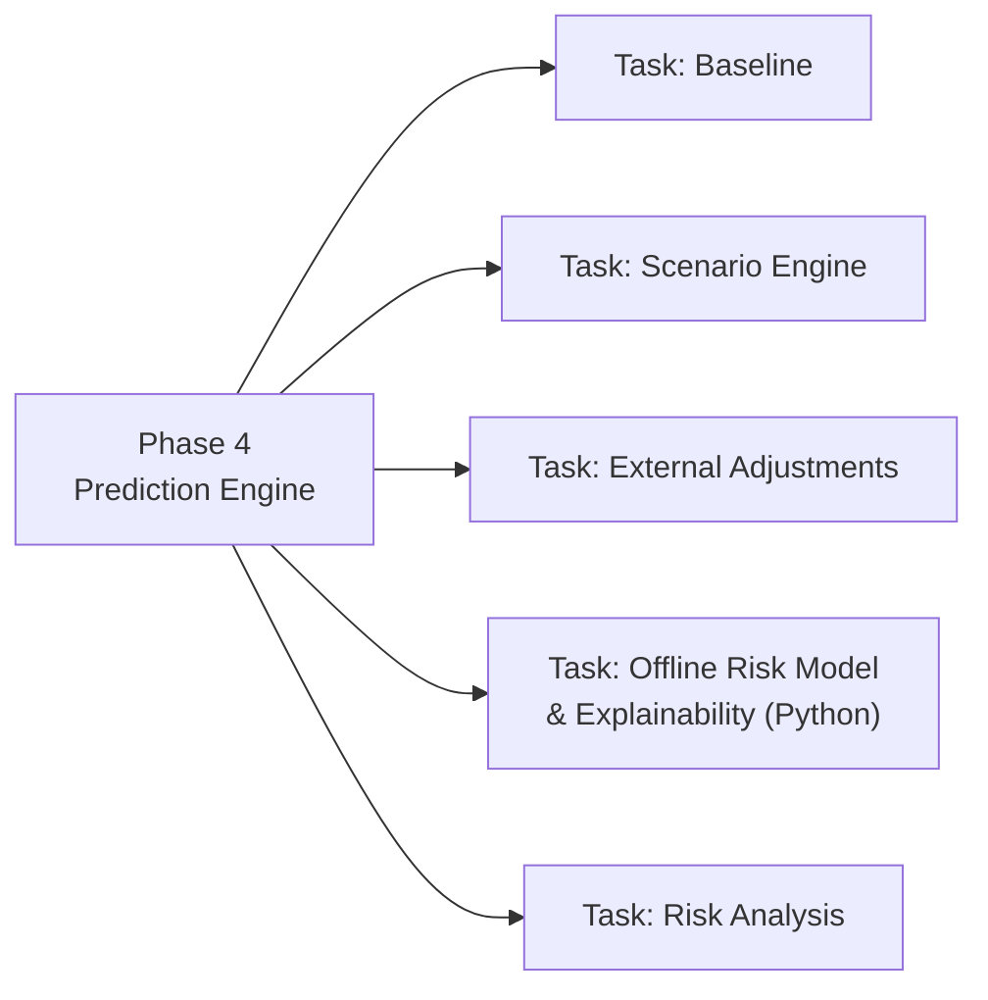
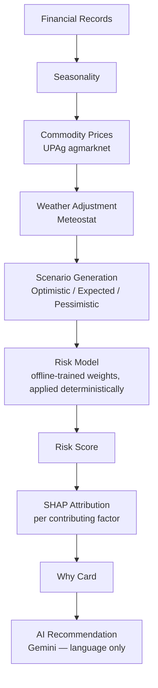
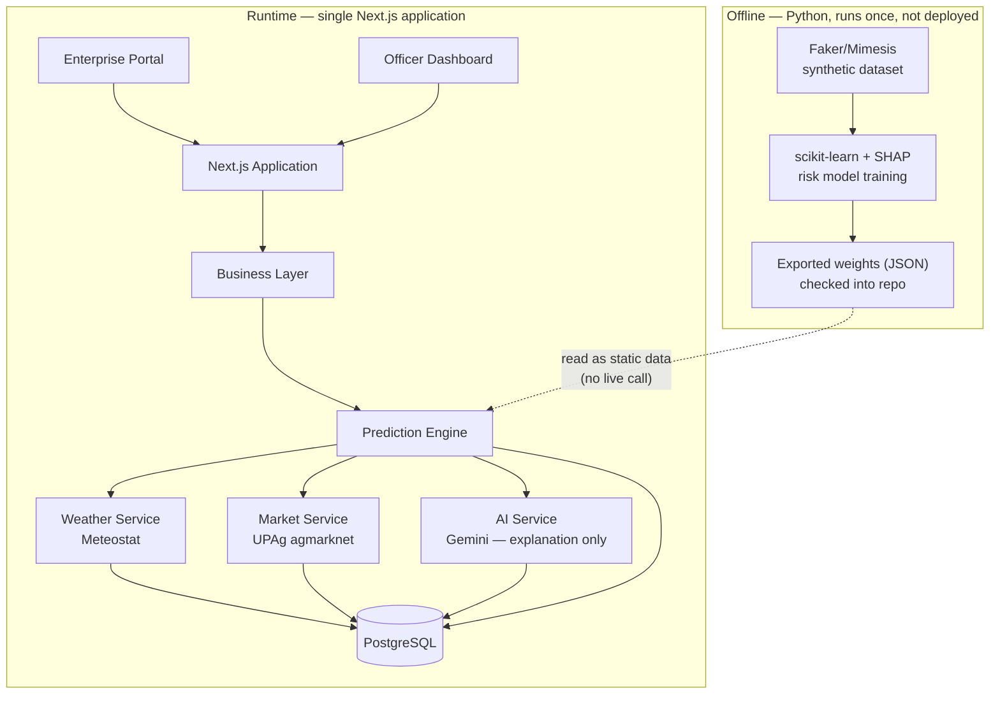

# 🌾 Fasal Becho

> **A Rule-Based Cash-Flow Scenario Simulator & Explainable Risk Triage Layer for Rural Micro Enterprises**

<p align="center">


</p>

<p align="center">

**Predict Tomorrow. Intervene Today.**

</p>

---

### ▶️ Starting or resuming development

You only ever need to give one instruction:

```
Start with PROMPTS.md
```

That's it. [`docs/PROMPTS.md`](docs/PROMPTS.md) — specifically **Prompt 20, "Complete Feature Workflow"** — tells the assistant to read every spec document, check [`docs/CURRENT_WORKFLOW.md`](docs/CURRENT_WORKFLOW.md) and [`docs/Task.md`](docs/Task.md) for the active phase/task/process, plan the next unit of work, implement it, verify it, and update the tracking docs. No extra context needs to be repeated between sessions — see [📐 Spec-Driven Development](#-spec-driven-development) below for why.

---

## Table of Contents

- [🚀 Overview](#-overview)
- [❗ Problem](#-problem)
- [💡 Solution](#-solution)
- [📐 Spec-Driven Development](#-spec-driven-development)
- [🗺 Development Phases](#-development-phases)
- [✨ Key Features](#-key-features)
- [🔄 Prediction Pipeline](#-prediction-pipeline)
- [🏗 Architecture](#-architecture)
- [🛠 Tech Stack](#-tech-stack)
- [🌐 External Data Sources](#-external-data-sources)
- [📚 Documentation Map](#-documentation-map)
- [📁 Project Structure](#-project-structure)
- [🎯 Demo Flow](#-demo-flow)
- [🚀 Local Setup](#-local-setup)
- [🛣 Future Roadmap](#-future-roadmap)
- [👥 Team](#-team)
- [📄 License](#-license)

---

## 🚀 Overview

Fasal Becho is a decision-support platform built for the **NABARD Hackathon**. It helps a NABARD field officer triage hundreds of rural micro-enterprises — prioritizing the handful most likely to face cash-flow stress next, instead of relying on infrequent, ad hoc check-ins.

**Honest framing:** this is not an AI model claiming proven predictive accuracy on real-world cash flow — that claim doesn't hold up on synthetic, rule-generated data. It's a **transparent, deterministic scenario simulator** (four signals → a triage priority) **with an AI explainability layer** on top that turns each flag into a plain-language reason. See [`docs/idea.md`](docs/idea.md) for the full framing.

Instead of replacing human judgement, Fasal Becho provides explainable scenarios, prioritized risk queues, and AI-generated plain-language explanations that support faster, more informed interventions. Every flag is advisory — the officer always makes the final call.

---

## ❗ Problem

Rural micro-enterprises often lack continuous financial monitoring.

Field officers typically react **after** businesses experience financial stress.

Challenges include:

- Manual monitoring
- Seasonal income fluctuations
- Commodity price volatility
- Weather uncertainty
- Large number of enterprises per officer

---

## 💡 Solution

Fasal Becho runs a deterministic, auditable 4-step pipeline over:

- 📊 Financial records (synthetic UPI velocity baseline)
- 🌾 Commodity prices (UPAg `agmarknet`)
- 🌦 Weather signals (Meteostat)
- 🗓 Sector seasonality (crop/festival calendar)

then layers **AI only for explanation** (never for the calculation itself) to generate:

- Triple cash-flow scenarios (Optimistic / Expected / Pessimistic)
- Working Capital Dip alerts
- Risk prioritization (officer risk queue)
- Why Cards (plain-language attribution)
- AI recommendations

---

## 📐 Spec-Driven Development

Nothing gets built without a spec behind it. Every implementation decision traces back through a fixed chain of documents — read top to bottom once, then let `PROMPTS.md` drive every session after that.



The methodology, in three rules:

1. **Every phase is broken into tasks, and every task into processes.** Nothing is implemented as one undifferentiated blob — see [🗺 Development Phases](#-development-phases).
2. **The spec docs outrank the code.** If an implementation and a spec disagree, the spec wins (with `idea.md` / `Feature List.md` / `Sources Reference.md` outranking even `AGENTS.md` on product framing and priority — see the note at the top of `docs/Agent.md`).
3. **One instruction resumes everything.** `docs/CURRENT_WORKFLOW.md` always reflects the live state, so `PROMPTS.md` can pick up exactly where the last session left off without you re-explaining context.

---

## 🗺 Development Phases

Tracked task-by-task in [`docs/Task.md`](docs/Task.md); the dependency narrative for *why* this order lives in [`docs/ROADMAP.md`](docs/ROADMAP.md). No phase begins before its dependencies are complete, and no phase is "done" until every process inside every one of its tasks is checked off.

```
Planning          ██████████ 100%
Development       ░░░░░░░░░░   0%
Testing           ░░░░░░░░░░   0%
Deployment        ░░░░░░░░░░   0%
```
*(live status: [`docs/CURRENT_WORKFLOW.md`](docs/CURRENT_WORKFLOW.md))*

| # | Phase | Tasks | Processes | Status |
|---|-------|:-:|:-:|:-:|
| 0 | Project Setup | 3 | 19 | ⬜ |
| 1 | Authentication | 2 | 8 | ⬜ |
| 2 | Enterprise Management | 3 | 11 | ⬜ |
| 3 | Financial Records | 4 | 20 | ⬜ |
| 4 | Prediction Engine *(incl. offline risk model + SHAP)* | 5 | 18 | ⬜ |
| 5 | Explainability | 2 | 6 | ⬜ |
| 6 | Officer Dashboard | 4 | 15 | ⬜ |
| 7 | Offline Support | 2 | 6 | ⬜ |
| 8 | UI & UX | 3 | 10 | ⬜ |
| 9 | Testing | 3 | 12 | ⬜ |
| 10 | Deployment | 2 | 9 | ⬜ |
| **Total** | **11 phases** | **33** | **134** | |

<details>
<summary><strong>How the nesting works — Phase 4 (Prediction Engine) expanded as an example</strong></summary>



- **Task: Baseline**
  - Process: Revenue calculation
  - Process: Expense calculation
  - Process: Working capital calculation
- **Task: Scenario Engine**
  - Process: Optimistic scenario
  - Process: Expected scenario
  - Process: Pessimistic scenario
- **Task: External Adjustments**
  - Process: Seasonality adjustment (sector crop/festival calendar)
  - Process: Commodity price adjustment (UPAg `agmarknet`)
  - Process: Weather adjustment (Meteostat)
- **Task: Offline Risk Model & Explainability** *(Python — not part of the running app)*
  - Process: Train lightweight model (scikit-learn) on the frozen synthetic dataset
  - Process: Hold out generator parameters for train/test validation (Stretch rigor)
  - Process: Compute SHAP feature attributions
  - Process: Export model weights + baselines as static JSON
  - Process: Import exported weights into the TypeScript Prediction Engine and apply deterministically
- **Task: Risk Analysis**
  - Process: Risk score (deterministic arithmetic + exported model weights)
  - Process: Risk level
  - Process: Working capital dip detection
  - Process: PMFBY claims cross-check for weather-deflator sanity *(optional validation, Important tier)*

A phase is only complete when every process in every task above is checked off in `docs/Task.md` and the phase's definition-of-done in `docs/ROADMAP.md` passes.

</details>

---

## ✨ Key Features

| Enterprise | Officer | Intelligence |
|------------|----------|--------------|
| Business Profile | Risk Queue | Triple Forecast |
| Financial Records | Dashboard | Working Capital Alert |
| Income & Expenses | Enterprise Review | Explainable Why Card |
| Loans & Savings | Officer Actions | AI Recommendations |
| Offline Support | Search & Filters | Scenario Simulation |

---

## 🔄 Prediction Pipeline



The Risk Model node is not live inference — it's a static artifact trained once in Python and read like any other data file. See [🛠 Tech Stack](#-tech-stack) and [`docs/ARCHITECTURE.md`](docs/ARCHITECTURE.md) Section 3a.

---

## 🏗 Architecture



Full layer/module breakdown: [`docs/ARCHITECTURE.md`](docs/ARCHITECTURE.md) (Section 3a covers the Offline pipeline specifically).

---

## 🛠 Tech Stack

| Layer | Technology |
|------|------------|
| Frontend | Next.js + React + TypeScript |
| UI | Tailwind CSS + shadcn/ui |
| Backend | Next.js Route Handlers |
| ORM | Prisma |
| Database | PostgreSQL |
| **Data Science** *(offline only — see below)* | **Python**, Faker / Mimesis, NumPy / Pandas, scikit-learn, SHAP |
| Generative AI *(runtime, language only)* | Gemini |
| Charts | Recharts |
| Offline *(client, PWA)* | PWA + IndexedDB |
| Deployment | Vercel |

> **Where's the AI/ML?** The risk model is real, trained machine learning — a small, transparent scikit-learn model explained with SHAP feature attributions — not a rebrand of a REST call. It is trained **offline in Python, once**, and its weights are exported as a static artifact checked into the repo. The deployed app is still a single Next.js/TypeScript runtime: it *reads* those weights and applies them as plain, deterministic arithmetic — it never trains a model or calls a live Python process. Gemini is a separate, unrelated integration used only to turn the resulting numbers into plain-language sentences. Full detail: [`docs/ARCHITECTURE.md`](docs/ARCHITECTURE.md) (Section 3a).

---

## 🌐 External Data Sources

Primary (wired into the live pipeline):

- **UPAg `agmarknet`** — mandi commodity prices, Step 3 (Market Reality)
- **Meteostat** — historical weather by station/lat-long, Step 4 (Weather Deflator)
- **Faker/Mimesis** — synthetic transaction generator (fixed seed, sector-specific), the foundation everything else calibrates against
- **scikit-learn + SHAP** — the risk model, trained offline once on the synthetic dataset, exported as static weights; the project's actual AI/ML development
- **Gemini** — explanation and recommendation text only, never the calculation

Secondary / calibration / cut for the hackathon — see [`docs/Sources Reference.md`](<docs/Sources Reference.md>) for the full breakdown:

- NPCI aggregate stats (macro calibration for the synthetic generator, not a live input)
- Sahamati Account Aggregator schema (shape reference for mock records — AA integration itself is mocked, not live)
- Secondary UPAg sources (`enam`, `wpi`, `pmfby_ay`, `ncdex`, etc.) — optional depth, cut first if time-constrained

---

## 📚 Documentation Map

| Document | Purpose |
|---|---|
| [`docs/idea.md`](docs/idea.md) | **Start here.** The honest framing — why this exists, what it is/isn't, open questions |
| [`docs/Feature List.md`](<docs/Feature List.md>) | Priority tiers: Core / Important / Cut / Pitch-only / Stretch |
| [`docs/Sources Reference.md`](<docs/Sources Reference.md>) | How every external data source is actually used, and in what priority order |
| [`docs/PRD.md`](docs/PRD.md) | Product requirements — users, workflows, MVP scope |
| [`docs/ARCHITECTURE.md`](docs/ARCHITECTURE.md) | System architecture — layers, modules, data flow |
| [`docs/DATABASE.md`](docs/DATABASE.md) | Logical data model — entities, relationships, validation |
| [`docs/API.md`](docs/API.md) | API contract — endpoints, response shape, standards |
| [`docs/ROADMAP.md`](docs/ROADMAP.md) | Phase sequencing and dependency order (the "why this order") |
| [`docs/Task.md`](docs/Task.md) | Phase → Task → Process checklist (the live build tracker) |
| [`docs/CURRENT_WORKFLOW.md`](docs/CURRENT_WORKFLOW.md) | Current state — what's active right now, updated every session |
| [`docs/PROMPTS.md`](docs/PROMPTS.md) | **The execution driver** — the prompt library that runs everything above |
| [`docs/Agent.md`](docs/Agent.md) | AGENTS.md — engineering source of truth for AI coding assistants |
| [`docs/PROJECT_RULES.md`](docs/PROJECT_RULES.md) | Engineering rules and definition of done |

---

## 📁 Project Structure

```text
app/
components/
services/
business/
prisma/
public/
docs/
```

---

## 🎯 Demo Flow

The demo opens on the **Officer Dashboard**, not a landing page — the Risk Queue is the strongest first impression.

1. Open Officer Dashboard → Risk Queue (sorted priority list)
2. Open a high-risk enterprise
3. View the triple-scenario cash-flow chart
4. See the Working Capital Dip alert
5. Read the Why Card (plain-language attribution per flag)
6. Read the AI recommendation
7. Record an officer action (or override the alert)

---

## 🚀 Local Setup

```bash
git clone <repo>

cd app

npm install

cp .env.example .env

npm run dev
```

**Data science pipeline (optional, offline only)** — only needed if you're regenerating the synthetic dataset or retraining the risk model, not for running the app itself:

```bash
pip install faker mimesis numpy pandas scikit-learn shap meteostat
```

---

## 🛣 Future Roadmap

Post-hackathon only — none of these are MVP scope, see [`docs/Feature List.md`](<docs/Feature List.md>) for what's explicitly cut vs. genuinely stretch:

- Multi-sector support
- Portfolio analytics
- Heatmaps
- Notifications
- Mobile application
- Account Aggregator integration

---

## 👥 Team

Built for the **NABARD Hackathon 2026**.

---

## 📄 License

MIT License
